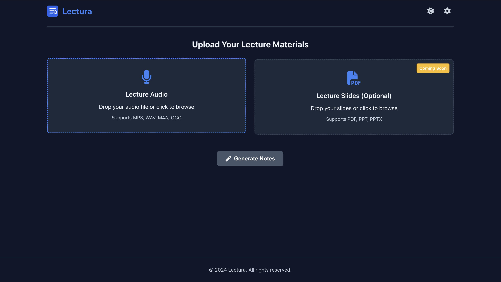

# Lectura - AI-Powered Lecture Notes

Lectura is a streamlined tool that automatically generates comprehensive, well-structured notes from lecture recordings and slides using AI models. It supports both local and cloud-based AI providers.

## Features

- **Audio Transcription**: Transcribe lecture audio using MLX Whisper (locally)
- **Notes Generation**: Generate comprehensive, well-structured notes from transcriptions using AI
- **Multiple AI Providers**: Support for OpenAI, Anthropic, Google Gemini, local models, and Ollama
- **Custom API Support**: Configure custom API endpoints and models
- **Real-time Progress Tracking**: Dynamic progress indicators for each processing phase
- **Emoji-Enhanced Notes**: Generated notes include emojis for better readability and engagement
- **Clean UI**: Modern, responsive web interface with drag-and-drop file uploads
- **Dark/Light Mode**: Theme toggle with system default option
- **Coming Soon**: Slides processing (PDF, PPT, PPTX) integration

## Screenshots



## Requirements

- Node.js 14+
- Python 3.8+
- MLX Whisper (for audio transcription)

## Installation

1. Clone the repository:
   ```bash
   git clone https://github.com/Amir-Mohseni/lectura.git
   cd lectura
   ```

2. Install dependencies:
   ```bash
   npm run setup
   ```
   This will install both Node.js and Python dependencies.

3. Copy the example environment file and update it with your settings:
   ```bash
   cp .env.example .env
   ```

4. Start the server:
   ```bash
   npm start
   ```

5. Access the application at http://localhost:8000

## Usage

1. Open the application in your web browser
2. Upload a lecture audio file (MP3, WAV, M4A, OGG)
3. (Optional) Configure API settings via the settings icon
4. Click "Generate Notes"
5. Watch the progress through each phase (uploading, transcribing, generating, completed)
6. View and download your generated notes in Markdown format

## Configuration

You can configure the application using environment variables in the `.env` file:

- `PORT`: The port to run the server on (default: 8000)
- `NODE_ENV`: Environment mode (development or production)
- `API_KEY`: Your default API key (for Gemini by default)
- `API_MODEL`: Default model to use (default: gemini-2.0-flash)
- `API_BASE_URL`: Base URL for the default API (default: Google's Gemini API)
- `OPENAI_API_KEY`: Your OpenAI API key (for note generation)
- `ANTHROPIC_API_KEY`: Your Anthropic API key (for note generation)
- `WHISPER_MODEL`: The Whisper model to use (default is MLX Whisper default)
- `DEBUG`: Enable debug logging (true/false)

## API Provider Options

Lectura supports multiple AI providers for note generation:

1. **Default (Gemini)**: Uses Google's Gemini API with values from `.env`
2. **OpenAI**: Uses models like GPT-4 or GPT-3.5-turbo
3. **Anthropic**: Uses Claude models
4. **Local**: For local LLM servers
5. **Ollama**: For Ollama-based models
6. **Custom**: Configure your own API endpoint, model, and key

## Project Structure

```
lectura/
├── src/
│   ├── routes/           # Express route definitions
│   ├── services/         # Business logic services
│   │   ├── processingService.js    # Orchestrates the processing flow
│   │   ├── transcriptionService.js # Handles audio transcription
│   │   └── notesGenerationService.js # Handles notes generation (JS)
│   ├── static/           # Static assets (HTML, CSS, JS)
│   │   ├── css/          # Stylesheets
│   │   ├── js/           # Client-side JavaScript
│   │   └── images/       # Images and icons
│   ├── audio_processor.py # Python script for audio transcription
│   ├── notes_generator.py # Python script for notes generation
│   └── server.js         # Main Express server
├── uploads/              # Uploaded files (created at runtime)
├── .env                  # Environment variables
├── package.json          # Node.js dependencies
└── requirements.txt      # Python dependencies
```

## Processing Flow

When you click "Generate Notes", the application follows this process:

1. **Upload Phase**: Files are uploaded to the server
2. **Transcription Phase**: Audio is transcribed using MLX Whisper
3. **Generation Phase**: Notes are generated from the transcription using the selected AI provider
4. **Completion**: Results are displayed and available for download

Each phase is visually represented in the UI with dynamic progress indicators.

## Developing

For development with auto-restart:

```bash
npm run dev
```

## API Endpoints

### Upload Files

```
POST /api/upload
```

Upload audio files and optionally slides.

### Transcribe Audio

```
POST /api/transcribe
```

Transcribe an already uploaded audio file.

### Generate Notes

```
POST /api/generate-notes
```

Generate notes from a transcription.

### Process (All-in-one)

```
POST /api/process
```

Upload, transcribe, and generate notes in a single request. Accepts the following parameters:
- `audio`: Audio file (required)
- `slides`: Slides file (optional)
- `apiProvider`: API provider to use (default, openai, anthropic, local, ollama, custom)
- `model`: Model name for the selected provider
- `apiKey`: API key for the provider
- `apiEndpoint`: Custom API endpoint URL (for custom provider)
- `apiModelName`: Custom model name (for custom provider)
- `whisperModel`: Whisper model to use for transcription

## Technologies Used

- **Frontend**: HTML, CSS, JavaScript
- **Backend**: Node.js, Express
- **Transcription**: MLX Whisper
- **Notes Generation**: Python with support for multiple AI providers
- **Markdown Rendering**: Marked.js and Showdown.js

## Contributing

Contributions are welcome! Please feel free to submit a Pull Request.

## License

This project is licensed under the MIT License - see the LICENSE file for details.
